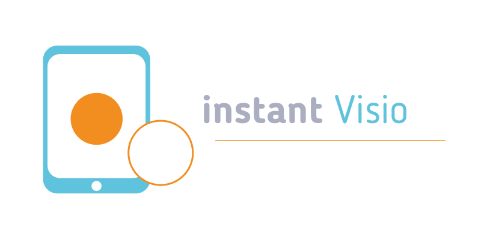

<p align="center">
Open source video conference app using Twilio and Daily, with SMS and Email.
</p>

---

<br/>

# API

_Current API Version: **v1**_

Currently in development and deployed for development propose only

-   [API Documentation](https://instantvisio-dev.web.app/api/v1-docs/)
-   [API Endpoint](https://instantvisio-dev.web.app/api/v1/)

# Setup

## Front

-   Make sure you have a correct version of `./.env.development`.

```bash
nvm use # Use correct node version
npm i # Install dependencies
npm start # Run the app
```

### Local Emulator

If you want to use Firebase Emulators to run the app locally:

```bash
cd functions;
export FIREBASE_AUTH_EMULATOR_HOST="localhost:9099"
nvm use; npm run serve-emulators
```

Furthermore, you need to change your `.env.development` file to set the following information:

```
REACT_APP_AUTH_EMULATOR_ENABLED=true
REACT_APP_API_URL=http://localhost:5050/.../api # Check the URL exposed by firebase functions emulator
```

### Seed local database

To seed/populate the emulator database with test users and some basic firestore data, you can use a route on the API. 
1. Start the API using emulators: `cd function && npm run serve-emulators`
2. Open `http://localhost:5050/instantvisio-dev/us-central1/api/api/v1-tests/seeds/` in your browser/postman/anything in GET
3. Upon success seeding, test users are answered by the network request

## Functions

-   Make sure you have a correct version of `./functions/runtimeconfig.json`
-   Your should be logged in with firebase-cli: `firebase login`
-   Select the development project: `firebase use instantvisio-dev`
-   The developer email should be added in firebase project in order to be able to locally run functions

```bash
cd functions
nvm use
npm i
npm run serve
```

## Mobile

1. Considering `platform` is either `android` or `ios`, you can **build** the project with

    ```bash
    nvm use
    npm i
    npm run build:${PLATFORM} # ex: npm run build:ios
    ```

    This command will build the web app, synchronise native plugin & assets with the native platform and open the mobile platform default `IDE`. You can then build and run the app using your `IDE`.

2. To only **open** the `IDE` you can use

    ```bash
    npm run open:${platform}
    ```

3. To build the app with livereload feature (for development purposes):

    ```bash
    npm run run:${PLATFORM}
    ```

# Guidelines

### Dev

-   JS & Typescript:
    -   use destructuring
    -   use TS types & interfaces
    -   small to medium (1 -> ~300 lines) components
    -   reusable components should be within `src/components`
    -   reducers/actions/selectors should live alongside and be scoped to the domain (possible domains: room/call, dashboard/stats, group)
    -   actions,reducers, props should be typed
    -   i18n for translation of every text
-   Libraries:
    -   keep the amount of libraries to a minimum to have the lowest possible bundle size
    -   form: Formik, Yup
    -   UI: Material UI, styled-components for customization
    -   state: Redux & redux-thunk for async actions, Immer JS for immutability
    -   routing: Ionic Router
-   Use interfaces to [define prop types](https://github.com/facebook/create-react-app/issues/8021) in typescript
-   Testing:
    -   front & back: test suite are setup but not actively used. We may move the project to a totally different idea, so it reduces the pain on this side

### Code organization

    - branch name: you can use `issueNumber_feature-desc` but you are free to choose what you need
    - draft Pull Request for early on WIP codes (if needed)
    - public the PR and submit it for the review
    - review: add 2 or more reviewers, one of them being either [MattiaPrimavera](https://github.com/MattiaPrimavera) or [HugoGresse](https://github.com/HugoGresse). At least one approve for the PR to be considered as accepted and ready to be merged. Review comments should be marked as resolved after change made if agreed to. If needed, re-request the review after change mades. Review submit should be `Request change` or `Approve`, only use `Comment` if this is just light discussion which are not important.
    - Pull Request are merged using `Squash & merge`
    - Pull Request description: anything you think is necessary to understand the code scope, linked issue, etc. Add how to review notes if needed
    - Responsability: the PR assignee is responsible for updating the branch, iterating on review and merging the branch
